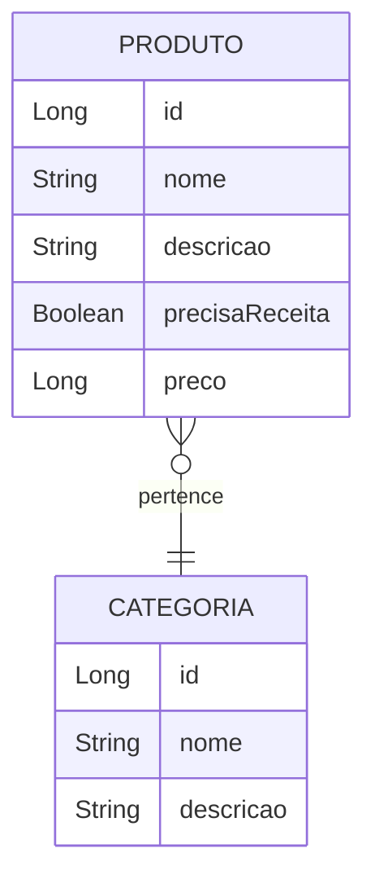

# 💊 CRUD-Farmacia

## 📝 Descrição

Este é um **sistema de backend** desenvolvido para gerenciar uma farmácia. A API inclui funcionalidades para:
- **Produtos**: Gerenciamento de itens disponíveis, com informações detalhadas, como necessidade de receita médica.
- **Categorias**: Classificação dos produtos por categoria, permitindo consultas avançadas.

Funcionalidades incluem operações **CRUD** completas para ambas as entidades e busca por descrição e categoria.

---

## 🛠️ Tecnologias Utilizadas

- **Java 21**: Linguagem de programação principal.
- **Spring Boot**: Framework para desenvolvimento rápido de aplicações.
- **Spring Data JPA**: Para mapeamento objeto-relacional.
- **MySQL**: Banco de dados relacional.
- **Maven**: Gerenciador de dependências.
- **Spring Web**: Para exposição de APIs REST.

---

## 🔗 Relacionamento entre Entidades



---

## 📂 Estrutura do Projeto

### 🧑‍💻 Entidades e Relacionamentos

#### 1️⃣ **Produto**
Representa os itens disponíveis na farmácia.

**Atributos**:
- `id (Long)`: Identificador único.
- `nome (String)`: Nome do produto.
- `descricao (String)`: Descrição detalhada do produto.
- `categoria (Categoria)`: Categoria a que o produto pertence.
- `precisaReceita (Boolean)`: Indica se o produto exige receita médica.
- `preco (Long)`: Preço do produto.

**Relacionamento**:
- Um produto pertence a uma categoria.

#### 2️⃣ **Categoria**
Classifica os produtos, como "Medicamentos", "Beleza" ou "Suplementos".

**Atributos**:
- `id (Long)`: Identificador único.
- `nome (String)`: Nome da categoria.
- `descricao (String)`: Descrição detalhada da categoria.

**Relacionamento**:
- Uma categoria pode ter vários produtos.

---

## 🌟 Funcionalidades

### 🔑 CRUD de Categorias
- **Criar**: Cadastro de novas categorias.
- **Ler**: Recuperar informações por ID ou listar todas.
- **Atualizar**: Alterar dados de uma categoria existente.
- **Excluir**: Remover uma categoria do sistema.
- **Buscar por Nome**: Localizar categorias pelo nome.
- **Buscar por Descrição**: Localizar categorias pela descrição.

### 🛒 CRUD de Produtos
- **Criar**: Cadastro de novos produtos.
- **Ler**: Recuperar informações por ID ou listar todos.
- **Atualizar**: Alterar dados de um produto existente.
- **Excluir**: Remover um produto do sistema.
- **Buscar por Nome**: Localizar produtos pelo nome.
- **Buscar por Categoria**: Localizar produtos por categoria.

---

## 🔗 Estrutura dos Endpoints

### **Categoria**
| Método HTTP | Endpoint                        | Descrição                     |
|-------------|---------------------------------|-------------------------------|
| POST        | `/categorias`                  | Adicionar nova categoria       |
| GET         | `/categorias`                  | Listar todas as categorias     |
| GET         | `/categorias/id/{id}`             | Buscar categoria por ID        |
| PUT         | `/categorias`                  | Atualizar categoria por ID     |
| DELETE      | `/categorias/delete/{id}`             | Remover categoria por ID       |
| GET         | `/categorias/nome/{nome}`      | Buscar categoria por nome      |
| GET         | `/categorias/descricao/{descricao}` | Buscar categoria por descrição |

### **Produto**
| Método HTTP | Endpoint                        | Descrição                     |
|-------------|---------------------------------|-------------------------------|
| POST        | `/produtos`                    | Adicionar novo produto         |
| GET         | `/produtos`                    | Listar todos os produtos       |
| GET         | `/produtos/id/{id}`               | Buscar produto por ID          |
| PUT         | `/produtos`                    | Atualizar produto por ID       |
| DELETE      | `/produtos/delete/{id}`               | Remover produto por ID         |
| GET         | `/produtos/nome/{nome}`        | Buscar produto por nome        |
| GET         | `/produtos/categoria/{categoria}` | Buscar produtos por categoria |

---

## 🚀 Como Executar o Projeto

1. **Clone o repositório**:
   ```bash
   git clone https://github.com/MatheusSPQ/CRUD-Farmacia.git
   cd CRUD-Farmacia
   ```

2. **Configure o banco de dados**:
   - No arquivo `application.properties`, configure as credenciais do seu banco MySQL.

3. **Execute a aplicação**:
   ```bash
   mvn spring-boot:run
   ```

4. **Teste os endpoints**:
   - Utilize o **Postman** ou **Insomnia** para validar as rotas da API.

---

## 👨‍💻 Autor

**[Matheus Queiroz](https://github.com/MatheusSPQ)** 🛠️
- Desenvolvedor responsável por toda a implementação e documentação do projeto.
